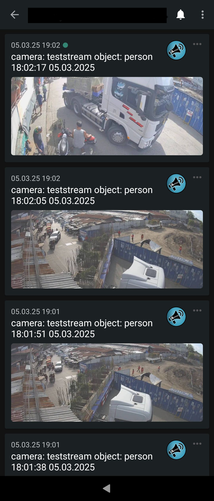

# Frigate Notification Service

<p float="left">
  
  
</p>

This tool is designed to run alongside Frigate, Mqtt and Apprise in one docker-compose setup.
It will forward Frigate Notifications to Apprise, which in turn allows us to receive notifications for a ton of popular services, including Discord, Telegram, MS Teams, Signal, Threema, ntfy.sh, ...
It also has native support for Telegram notifications, which might be used in the future to send commands to frigate, but this is a TODO.

## Installation

Example docker-compose.yaml:

```yaml
services:
  frigate:
  ...your friagte stuff here
    networks:
      - internal #make sure frigate is in the docker network

  mqtt-server:
    container_name: mqtt-server
    restart: unless-stopped
    image: eclipse-mosquitto:2.0
    volumes:
      - ./mqtt_config:/mosquitto/config
    ports:
      - 1883:1883 #if you dont use it outside this container, you can remove this
    networks:
      - internal

  fnd:
    container_name: fnd
    depends_on:
      - mqtt-server
      - frigate
      - apprise
    restart: unless-stopped
    image: docker.io/biberino/fnd:0.1.4
    volumes:
      - ./fnd_conf:/fnd_conf
    ports:
      - 7777:7777
    networks:
      - internal

  apprise:
      image: caronc/apprise:latest
      environment:
          - APPRISE_STATEFUL_MODE=simple
          - APPRISE_WORKER_COUNT=1
      volumes:
          - ./ap_config:/config
          - ./ap_plugin:/plugin
          - ./ap_attach:/attach
      ports:
          - "7778:8000"
      networks:
        - internal

networks:
  internal:
```

Only anonymous connections to Mqtt are supported at the moment, so make sure your mosquitto.conf contains

```
listener 1883 0.0.0.0
allow_anonymous true

```

- Make sure Frigate sends notification to the Mqtt Server, so in your config.yaml:

```yaml
mqtt:
  enabled: true
  host: mqtt-server
```

## Usage

- Goto <your-host>:7777 (or whatever you configured) and select Notifications. Set a cooldown and activate the cameras you want to receive notifications for.
- If everythins works as expected, you should see the last 3 incoming notifications in the overview.
- Now navigate to Apprise and follow the instructions
