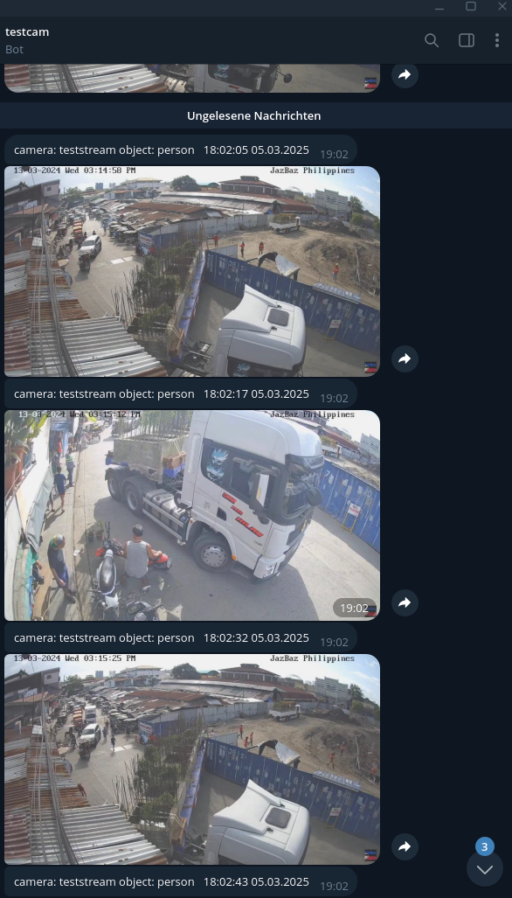

# Frigate Notification Service

This tool is designed to run alongside Frigate, Mqtt and Apprise in one docker-compose setup.
It will forward Frigate Notifications to Apprise, which in turn allows us to receive notifications for a ton of popular services, including Discord, Telegram, MS Teams, Signal, Threema, ntfy.sh, ...
It also has native support for Telegram notifications, which might be used in the future to send commands to frigate, but this is a TODO.

## Installation

Example docker-compose.yaml:

## Usage

- Goto <your-host>:7777 (or whatever you configured) and select Notifications. Set a cooldown and activate the cameras you want to receive notifications for.
- If everythins works as expected, you should see the last 3 incoming notifications in the overview.
- Now navigate to Apprise and follow the instructions
